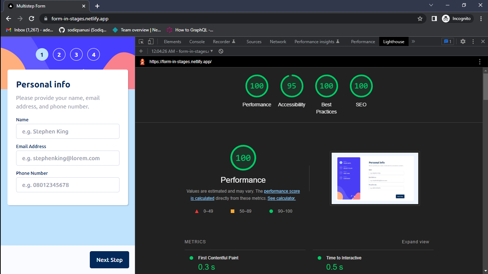

# Frontend Mentor - Multi-step form solution

This is a solution to the [Multi-step form challenge on Frontend Mentor](https://www.frontendmentor.io/challenges/multistep-form-YVAnSdqQBJ). Frontend Mentor challenges help you improve your coding skills by building realistic projects. 

## Table of contents

- [Overview](#overview)
  - [The challenge](#the-challenge)
  - [Screenshot](#screenshot)
  - [Links](#links)
- [My process](#my-process)
  - [Built with](#built-with)
  - [What I learned](#what-i-learned)
  - [Continued development](#continued-development)
  - [Useful resources](#useful-resources)
- [Author](#author)
- [Acknowledgments](#acknowledgments)

## Overview

As much as the overall goal was to build a replica of the provided designs alongside necessary functionalities, this was a project I built while in school. That's a first. Hopefully, I'll get to build more interfaces before the semester's end🤞🏾.

### The challenge

Users should be able to:

- Complete each step of the sequence
- See a summary of their selections on the final step and confirm their order
- View the optimal layout for the interface depending on their device's screen size
- See hover and focus states for all interactive elements on the page

### Screenshot

### Links

- Solution URL: [https://github.com/sodiqsanusi/multi-step-form/](https://github.com/sodiqsanusi/multi-step-form/)
- Live Site URL: [https://form-in-stages.netlify.app/](https://form-in-stages.netlify.app/)

## My process

As usual, almost same workflow with slight differentiations:
1. Sketched out the HTML structure & a rough components overview of the site on paper.
2. Used the `create-next-app` to get a boilerplate Next application.
3. Wrote the HTML/JSX for the top-level components that were important in the overall app.
4. Started styling for mobile/small screen devices *(had some issues with the component structure, it worked out in the end tho)*.
5. Made the site responsive for large screen devices.
6. Tweaked styles, then worked on functionalities *(this surprisingly didn't take as much time as I expected👀)*.
7. Used Lighthouse tool to check for possible improvements, then tweaked things using the gotten feedback.

### Built with

- Flexbox
- CSS Grid
- Mobile-first workflow
- [Next.js](https://nextjs.org/) - React framework
- CSS Modules

### What I learned

Honestly, can't really get myself to remember particular things I can say I learnt while building this, my mind is muddy😭. Anyways, this used a lot of things I was new to implementing. From the multiple states, to manual prerendering in Next, to some crazy validation checks (lol). It was a roller-coaster, a mind-thrilling one.

### Continued development

This is one of the first ever projects I'm building while also doing school stuffs. So it was a, uhmm, pioneer? Got to understand some dynamics to how this school-tech thing might work and I'm grateful for that.

The amount of state I managed in this project was crazy😂, and I used the React's Context API for all that. Next time I'm doing something that requires state management like this, I'll really love to try using Zustand for it. It seems like a really nice alternative to Redux/Redux Toolkit.

I'm also looking out for projects that will help me practice animations better. I haven't actually used heavy animation in any of my projects, so hopefully I get to do something that will help me brush up on that soon. 

### Useful resources

- [Everything You Ever Wanted to Know About inputmode - CSS Tricks](https://css-tricks.com/everything-you-ever-wanted-to-know-about-inputmode/) - From trying to disable the increment/decrement functionality on number inputs, I stumbled into this article. `inputmode` is a new attribute I got to learn about, and will probably use more often now.
- [CSS `:has` selector - Ishadeed](https://ishadeed.com/article/css-has-parent-selector/) - Had a styling problem where I was genuinely confused on how to implement it, ended up using the CSS `:has` selector and this article helped explain in explicit details how the selector works.

## Author

- Frontend Mentor - [@sodiqsanusi](https://www.frontendmentor.io/profile/sodiqsanusi)
- Twitter - [@sodiqsanusi_](https://www.twitter.com/sodiqsanusi_)

## Acknowledgments

Was really demotivated to build anything when I resumed into school, [Jude](https://github.com/youngancient) helped in pushing me to eventually start with it, really appreciate it bruv, thanks👌🏾.
